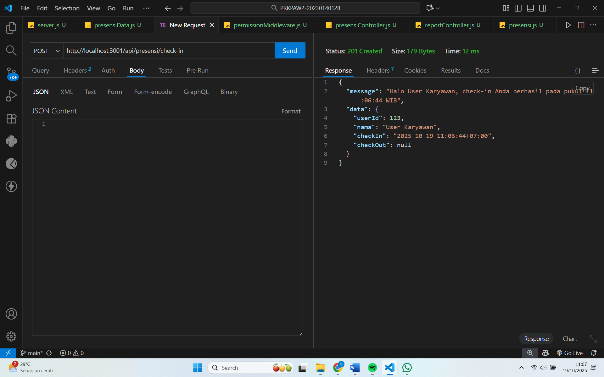
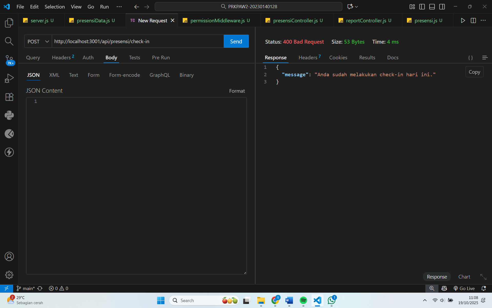
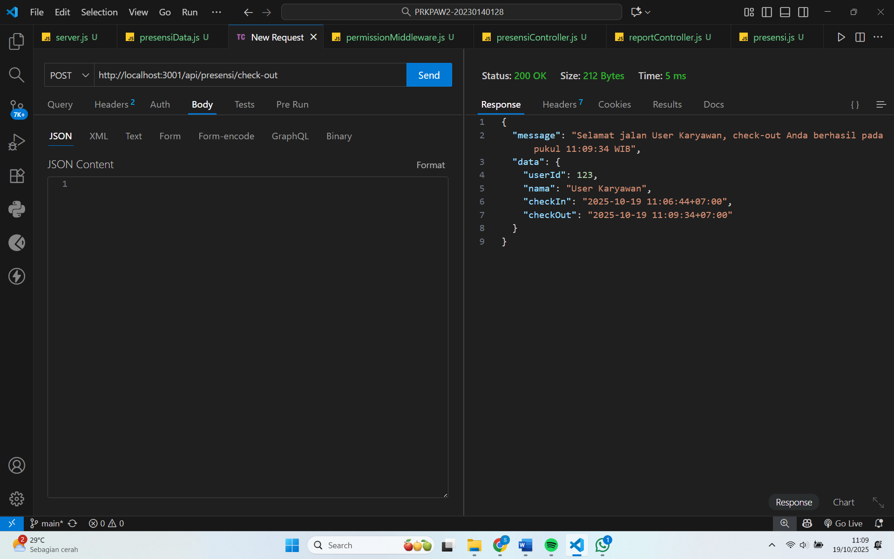
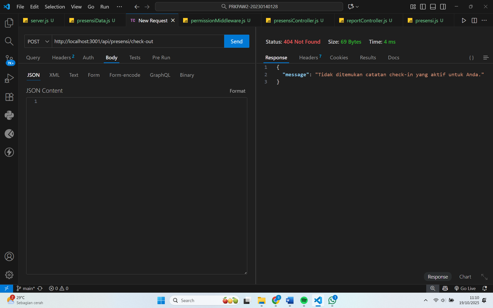
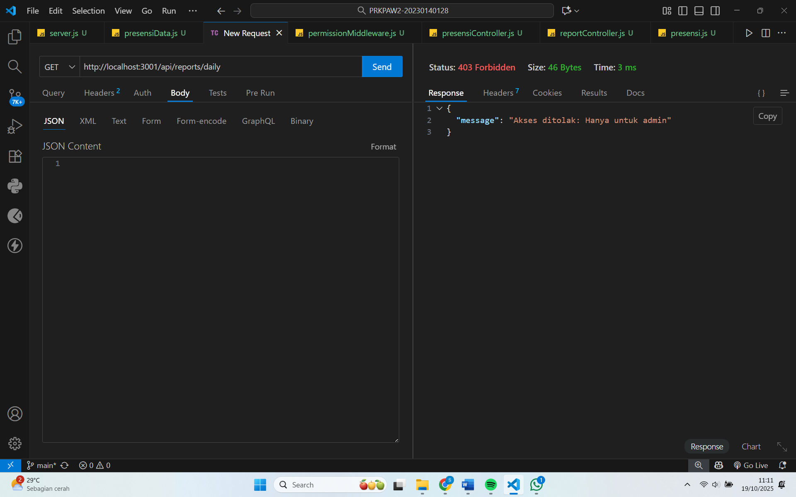

# Tugas praktikum 3
Tampilan Endpoint API Presensi dan Reports :

1. Presensi/check-in

2. Presensi/check-in jika dilakukan lebih dari 1 kali

3. Presensi/check-out

4. Presensi/check-out jika belum melakukan check-in

5. Reports/daily
