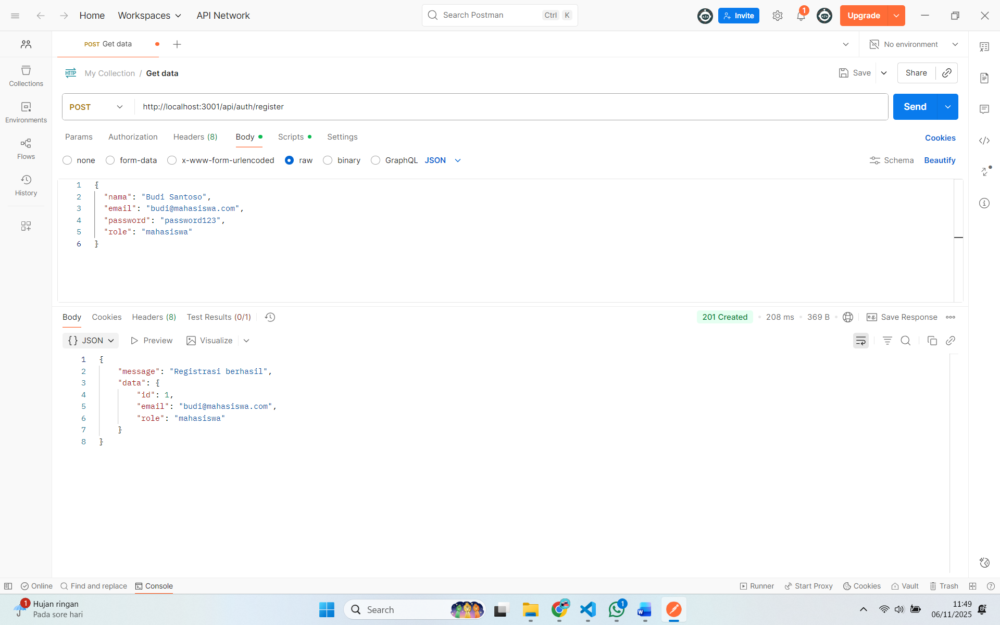
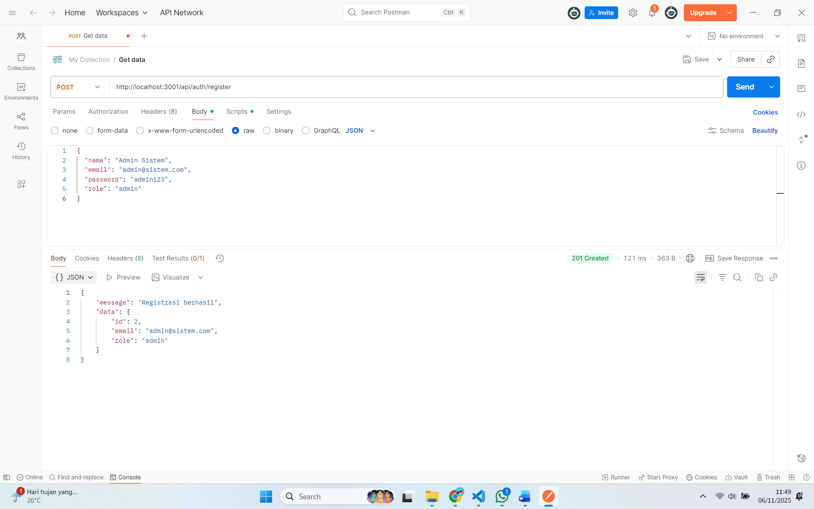
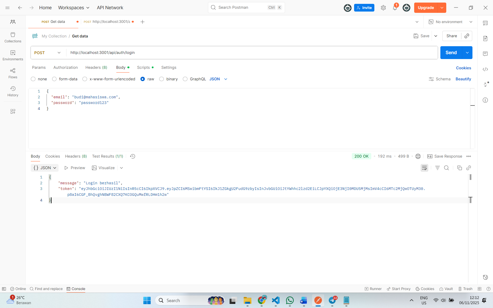

# Praktikum 6
1. Request POST /register (untuk membuat user "mahasiswa")

2. Request POST /register (untuk membuat user "admin")

3. Request POST /login (login sebagai "mahasiswa" dan mendapatkan token)

4. Database table presensi
