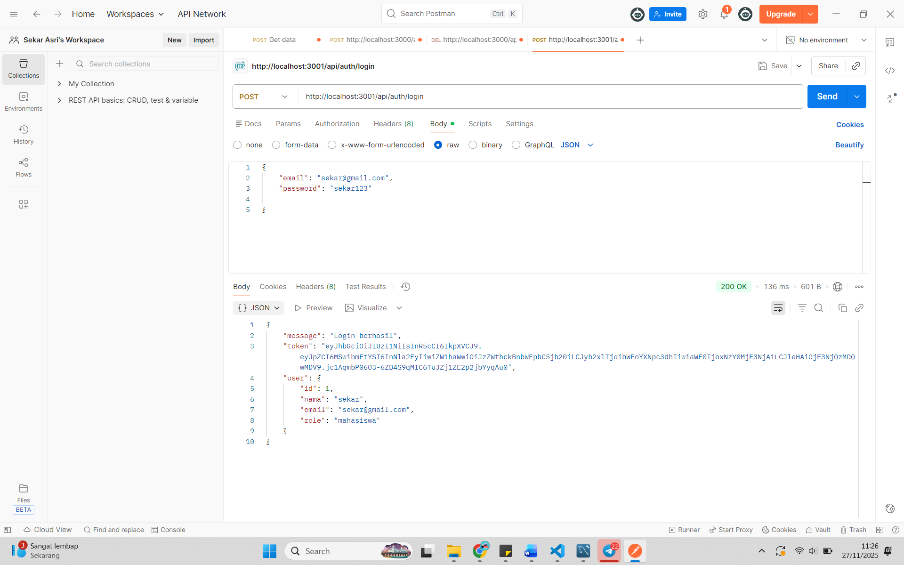
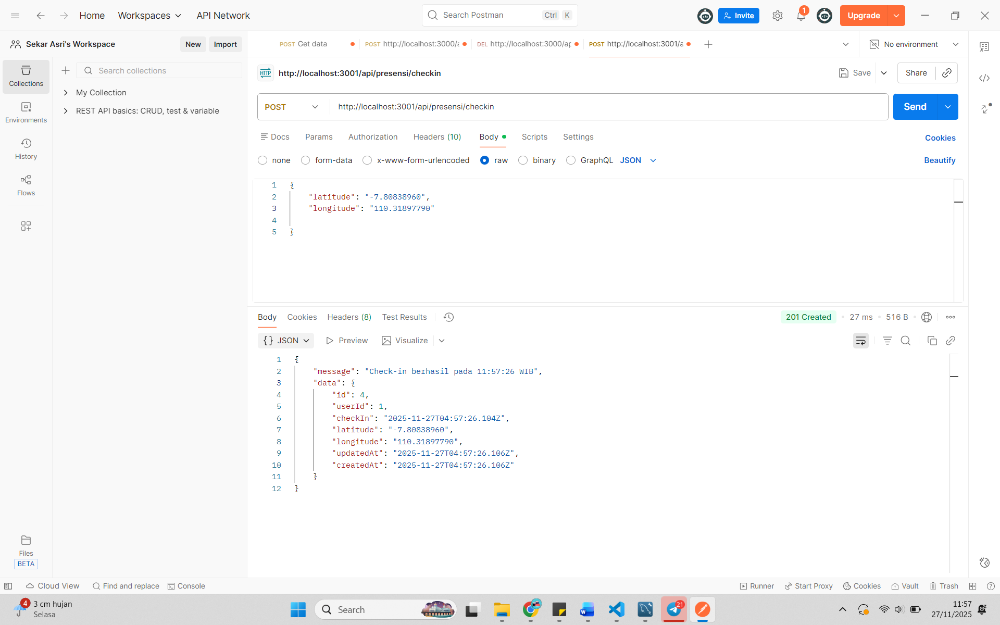
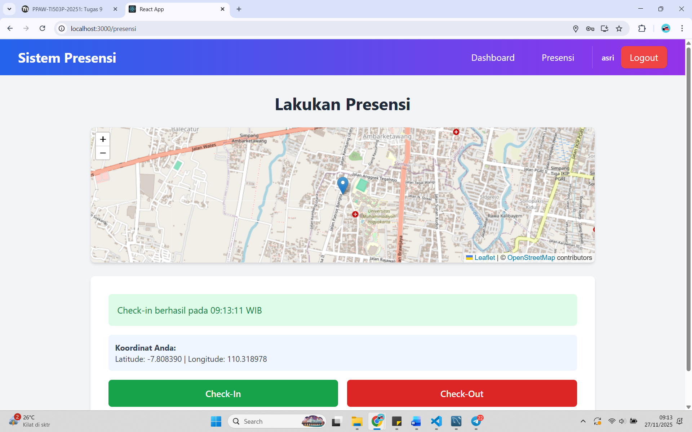
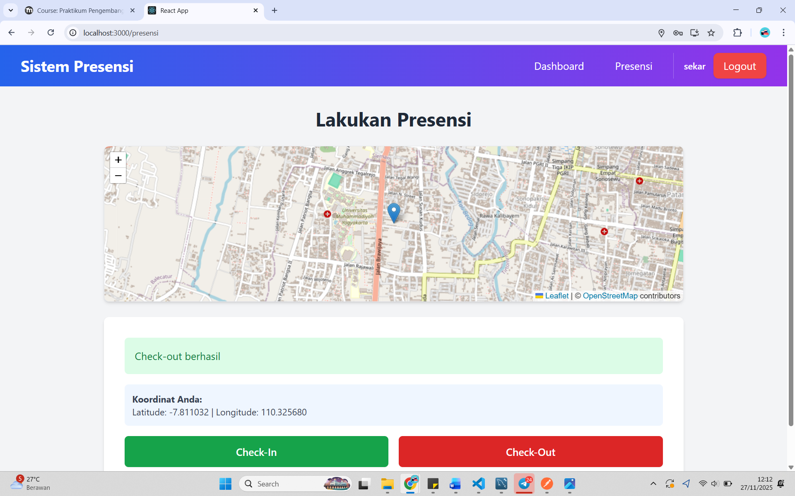
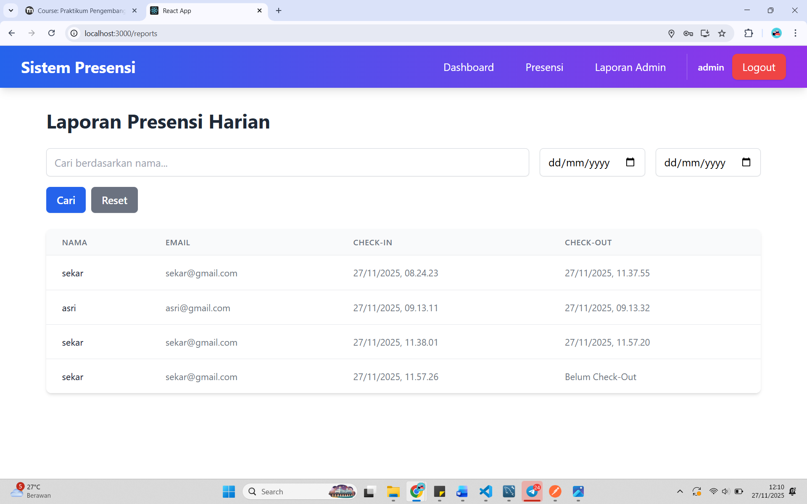
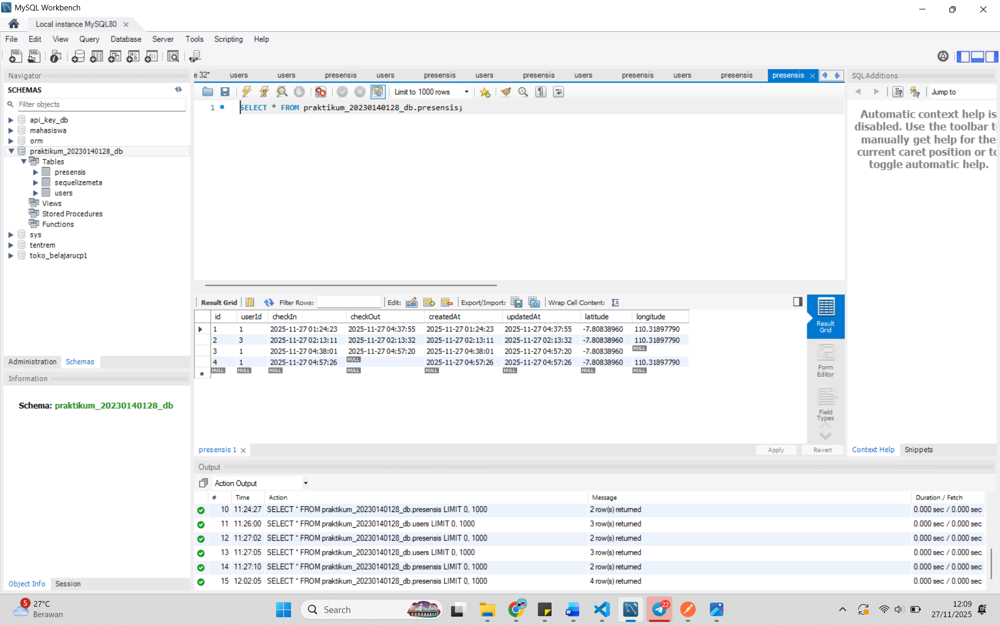

# Praktikum 9
1. Endpoint presensi/check-in dengan menggunakan bearer token dan body latitude, longitude

2. Tampilan halaman presensi dengan menampilkan maps OSM:
Check-in berhasil

Check-out berhasil

3. Tampilan halaman report yg berisi data presensi dari semua user

4. Screenshot tabel presensi di database
